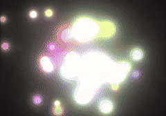

# 🎨 myballs

**myballs** is a lightweight GPU fragment shader toy that renders dynamic *metaballs* based on proximity and blending. It's built for fun, visual experimentation, and possibly giggles.

By default, the balls are rendered with randomized vibrant colors, but grayscale will give a more pronounced effect for visualizing proximity blending (aka the "metaballiness").

## 🛠️ Build and Run

Make sure you have [Odin](https://odin-lang.org/) installed.

```sh
odin build .
./myballs
```
## 🎮 Controls

<kbd>D</kbd> — Toggle debug view (shows influence circles)

<kbd>Left Mouse Button</kbd> — Explode the balls (scatter effect)

<kbd>Right Mouse Button</kbd> — Attract my balls (gravity toward cursor)

## 📸 Preview



---
Made with circles, shaders, and questionable naming choices.
